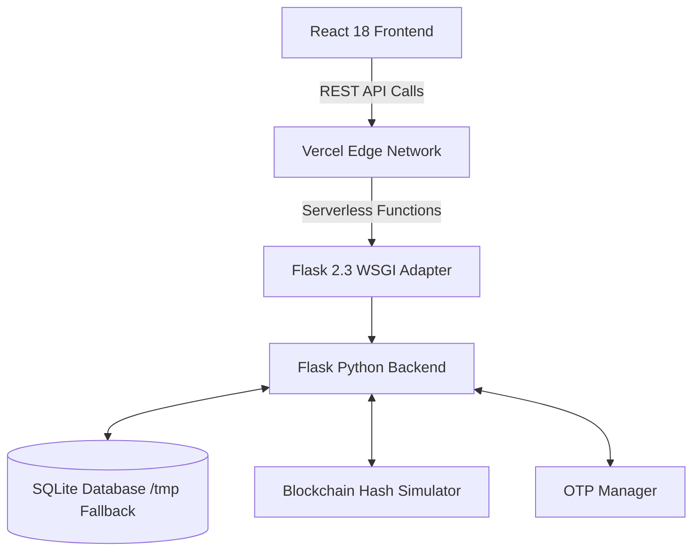

<div align="center">
  
# 🗳️ Secure E-Voting System
**A Next-Generation Electronic Voting Platform Built on Blockchain-Simulated Immutability**

[](https://vercel.com)
[](#)
[](#)
[](#)

</div>

---

## 📖 Overview

The **Secure E-Voting System** is a full-stack, monorepo architecture web application designed to solve the challenges of modern digital elections. It combines the seamless user experience of a React SPA (Single Page Application) with a highly secure Python Flask backend. 

To guarantee the integrity of election data, the system utilizes a **custom blockchain-simulated ledger**, ensuring that all cryptographic transaction hashes are tamper-proof and immutable. Access is strictly governed through a robust three-tier role-based access control (RBAC) system.

---

## ✨ Key Features

* **🛡️ Three-Tier Role Architecture**: 
  * **System Admin**: Oversees the entire platform, monitors real-time vote tallies, and manages election officers.
  * **Election Officer**: Creates, manages, and cycles the states of elections (Create → Activate → Close → Archive).
  * **Voter**: Authenticates securely and casts votes in a frictionless, mobile-responsive UI.
* **🔗 Blockchain-Simulated Ledger**: Every vote is recorded as an immutable transaction with a cryptographic hash, ensuring transparency and preventing tampering.
* **🔐 Multi-Factor OTP Authentication**: Voters are protected by a 6-digit OTP verification system, complete with expiry constraints and brute-force lockout mechanisms.
* **⚡ Vercel Serverless Ready**: Architected specifically to deploy flawlessly on Vercel's serverless infrastructure, utilizing dynamic `/tmp` disk fallback mechanisms.
* **🎨 Cyber-Minimalist UI**: A dark-themed, glassmorphic UI powered by `framer-motion` for buttery smooth micro-animations.

---

## 🏗️ Architecture



---

## 🚀 Local Development

### Prerequisites
* **Node.js** (v18+)
* **Python** (v3.10+)

### 1. Start the Python Backend
```bash
# Create and activate virtual environment
python3 -m venv venv
source venv/bin/activate  # On Windows: venv\Scripts\activate

# Install dependencies
pip install -r requirements.txt

# Start the Flask API
python app.py
```
│   └── SecureVoting_ABI.json   ← Contract ABI reference
│
└── frontend/                  ← React 18 SPA
    └── src/
        ├── api.js             ← API base URL config
        └── pages/
            ├── AdminLogin.js / AdminDashboard.js
            ├── OfficerLogin.js / OfficerDashboard.js
            └── VoterLogin.js / VoterDashboard.js
```

---

## 🔄 Election Lifecycle

```
Admin: Create Election  →  CREATED
Admin: Activate         →  ACTIVE   ← Voters can cast votes
Admin: Close            →  CLOSED   ← Results finalized
Admin: Archive          →  ARCHIVED
```

---

## 🛡️ Security

| Layer              | Implementation                        |
|--------------------|---------------------------------------|
| OTP Authentication | 6-digit, 5-min expiry, 3-attempt lock |
| Blockchain Ledger  | In-memory simulator with SHA-256 hashes|
| Role-Based Access  | Header-based RBAC middleware          |
| Input Sanitization | Regex filtering on all user inputs    |
| CORS Protection    | Configurable origin restriction       |

---

## ⚙️ Deployment

### Frontend Deployment (Vercel)
1. **Option A: GitHub Integration (Recommended)**
   - Go to [vercel.com/new](https://vercel.com/new) and import your repository.
   - Set **Root Directory**: `frontend`
   - Set **Framework Preset**: `Create React App`
   - In **Environment Variables**, add:
     - `REACT_APP_API_URL` = `https://your-backend-service.up.railway.app` (or your Flask server URL)
   - Click **Deploy**.

2. **Option B: Vercel CLI**
   ```bash
   cd frontend
   npx vercel
   ```
   Follow the prompts to connect your account and deploy!

### Full-Stack Monorepo Deployment (Vercel)
This repository includes a root `vercel.json` and `api/index.py` configured for Vercel Serverless Functions:
1. Import the root repository in Vercel.
2. In **Environment Variables**, add `FRONTEND_URL` pointing to your Vercel deployment URL.
3. Click **Deploy**.

---

## 📦 Tech Stack

| Layer     | Technologies                         |
|-----------|--------------------------------------|
| Backend   | Python · Flask · SQLite · Gunicorn   |
| Frontend  | React 18 · Framer Motion · Axios     |
| Blockchain| In-memory simulator (Solidity-based) |
| Auth      | OTP · Password hashing (SHA-256)     |

---

## 📄 API Endpoints

| Method | Endpoint                              | Role    |
|--------|---------------------------------------|---------|
| GET    | `/api/health`                         | Public  |
| POST   | `/api/login`                          | Public  |
| POST   | `/api/voter/request-otp`              | Public  |
| POST   | `/api/voter/verify-otp`               | Public  |
| GET    | `/api/generate-eth-address`           | Public  |
| GET    | `/api/admin/stats`                    | Admin   |
| POST   | `/api/admin/create-election`          | Admin   |
| POST   | `/api/admin/activate-election/:id`    | Admin   |
| POST   | `/api/admin/close-election/:id`       | Admin   |
| DELETE | `/api/admin/delete-election/:id`      | Admin   |
| GET    | `/api/admin/elections`                | Admin   |
| GET    | `/api/officer/voters`                 | Officer |
| POST   | `/api/officer/add-voter`              | Officer |
| PUT    | `/api/officer/update-voter/:id`       | Officer |
| DELETE | `/api/officer/delete-voter/:id`       | Officer |
| GET    | `/api/elections`                      | Voter   |
| POST   | `/api/cast-vote`                      | Voter   |

---

## 📝 License

This project is for educational and demonstration purposes.
